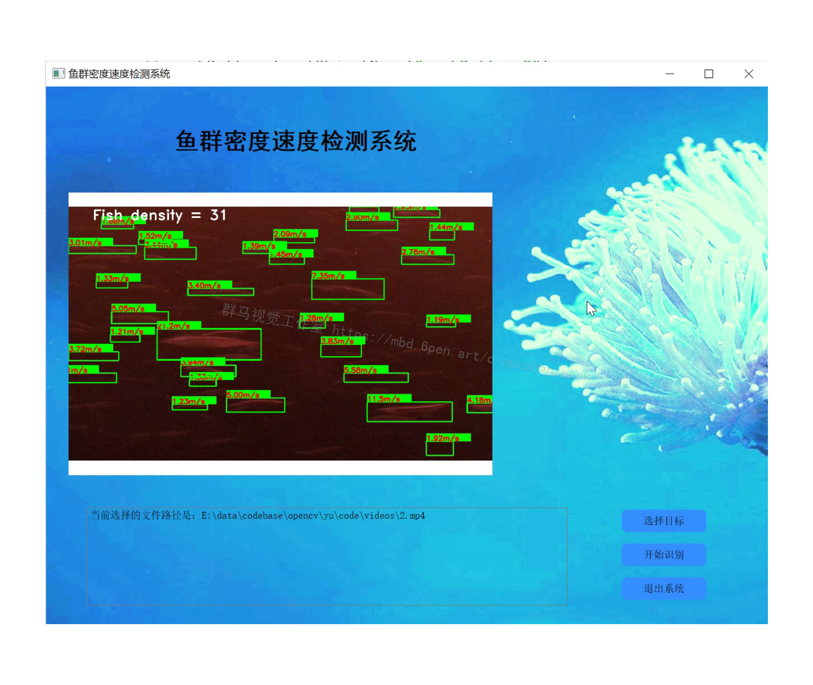
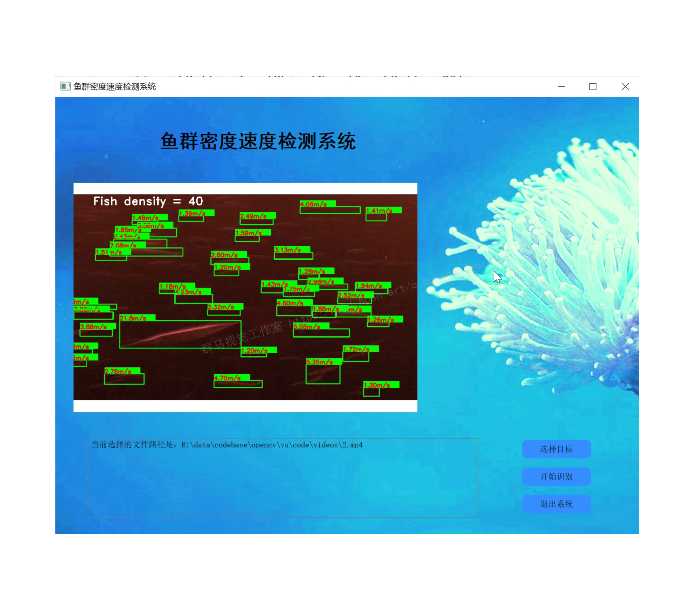
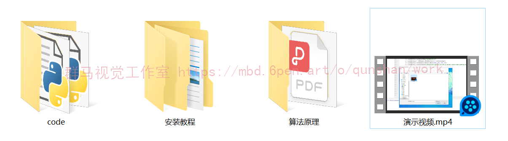

# 1.研究背景
智慧渔业是大数据、物联网与人工智能等现代信息技术驱动下的渔业发展新模式，是水产养殖业供给侧结构性改革的重要方式，涉及养殖环境监测、生物环境监测与生物状态监测这几大方面的应用与需求。本文从养殖产量与健康状态两个热点需求出发以鱼类为对象研究了鱼群密度估计与摄食状态量化两方面内容。本文采用密度估计的方法完成鱼群目标计数，通过估计鱼群图像密度间接获得目标数量。鱼群摄食行为侧面反映了鱼群的健康状态，评价其摄食行为的强弱有利于实现鱼群健康状态判断的数字化、信息化。

# 2.图片演示





# 3.视频演示
[Python基于Opencv的鱼群密度速度检测系统（源码＆教程）_哔哩哔哩_bilibili](https://www.bilibili.com/video/BV1TB4y177ma/?spm_id_from=333.999.0.0&vd_source=bc9aec86d164b67a7004b996143742dc)

# **4.算法原理：**
[该博客提出的移动侦测法](https://afdian.net/item?plan_id=18495b2259a611ed9da552540025c377)即是根据视频每帧或者几帧之间像素的差异，对差异值设置阈值，筛选大于阈值的像素点，做掩模图即可选出视频中存在变化的桢。帧差法较为简单的视频中物体移动侦测，帧差法分为：单帧差、两桢差、和三桢差。随着帧数的增加是防止检测结果的重影。
#### 帧间差分法(Temporal Difference)
由于场景中的目标在运动，目标的影像在不同图像帧中的位置不同。[该类算法](https://mbd.pub/o/bread/Y5mZl5lx)对时间上连续的两帧或三帧图像进行差分运算，不同帧对应的像素点相减，判断灰度差的绝对值，当绝对值超过一定阈值时，即可判断为运动目标，从而实现目标的检测功能。

# **5.算法流程图：**


# **6.代码实现：**
```
def threh(video,save_video,thres1,area_threh):
 cam = cv2.VideoCapture(video)#打开一个视频
 input_fps = cam.get(cv2.CAP_PROP_FPS)
 ret_val, input_image = cam.read()
 index=[]
 images=[]
 images.append(input_image)
 video_length = int(cam.get(cv2.CAP_PROP_FRAME_COUNT))
 input_image=cv2.resize(input_image,(512,512))
 ending_frame = video_length
 fourcc = cv2.VideoWriter_fourcc(*'XVID')
 out = cv2.VideoWriter(save_video,fourcc, input_fps, (512, 512))
 gray_lwpCV = cv2.cvtColor(input_image, cv2.COLOR_BGR2GRAY)
 gray_lwpCV = cv2.GaussianBlur(gray_lwpCV, (21, 21), 0)
 background=gray_lwpCV

# es = cv2.getStructuringElement(cv2.MORPH_ELLIPSE, (9, 4))

 i = 0 # default is 0
 outt=[]
 while(cam.isOpened()) and ret_val == True and i <2999:
  ## if i % 2==1:
  ret_val, input_image = cam.read()
  input_image=cv2.resize(input_image,(512,512))
  gray_lwpCV = cv2.cvtColor(input_image, cv2.COLOR_BGR2GRAY)
  gray_lwpCV = cv2.GaussianBlur(gray_lwpCV, (21, 21), 0)
  diff = cv2.absdiff(background, gray_lwpCV)
  outt.append(diff)
  #跟着图像变换背景
  tem_diff=diff.flatten()
  tem_ds=pd.Series(tem_diff)
  tem_per=1-len(tem_ds[tem_ds==0])/len(tem_ds)
  if (tem_per <0.2 )| (tem_per>0.75):
   background=gray_lwpCV
  else:
   diff = cv2.threshold(diff, thres1, 255, cv2.THRESH_BINARY)[1]
   ret,thresh = cv2.threshold(diff.copy(),150,255,0)
   contours, hierarchy = cv2.findContours(thresh,cv2.RETR_EXTERNAL,cv2.CHAIN_APPROX_SIMPLE)
  #  contours, hierarchy = cv2.findContours(diff.copy(), cv2.RETR_EXTERNAL, cv2.CHAIN_APPROX_SIMPLE)
   for c in contours:
    if (cv2.contourArea(c) < area_threh) | (cv2.contourArea(c) >int(512*512*0.3) ) :  # 对于矩形区域，只显示大于给定阈值的轮廓（去除微小的变化等噪点）
     continue
    (x, y, w, h) = cv2.boundingRect(c) # 该函数计算矩形的边界框
    cv2.rectangle(input_image, (x, y), (x+w, y+h), (0, 255, 0), 2) 
    index.append(i)
  #  cv2.imshow('contours', input_image)
  #  cv2.imshow('dis', diff)
  out.write(input_image)
  images.append(input_image)
  i = i+1
 out.release()
 cam.release()
 return outt,index,images```
##调取函数
outt=threh('new_video.mp4','test6.mp4',25,3000)
```
# **7.系统整合：**
[下图源码&环境部署视频教程&自定义UI界面](https://s.xiaocichang.com/s/ef9dec)

参考[博客《Python基于Opencv的鱼群密度速度检测系统（源码＆教程）》](https://mbd.pub/o/qunma/work)


# 8.参考文献
***
[1]王文秀.我国水产养殖业发展现状及前景[D].2019
[2]郭俊,郑堤,陈俊华,等.基于机器视觉跟踪的计数算法[D].2018
[3]张国维.鱼病诊断技术[D].2018
[4]王文静,徐建瑜,杜秋菊.基于计算机视觉的鱼苗自动计数系统研究[D].2016
[5]王硕,范良忠,刘鹰.基于计算机视觉的大菱鲆鱼苗计数方法研究[D].2015
[6]范嵩,刘娇,杨轶.图像识别技术在鱼苗计数方面的研究与实现[D].2008
[7]蒋妮,周海洋,余飞鸿.基于计算机视觉的目标计数方法综述[D].2021
[8]郭强,杨信廷,周超,等.基于形状与纹理特征的鱼类摄食状态检测方法[D].2018
[9]易金根,黄桂林.多通道鱼苗计数器光电微机控制系统设计[J].农业工程学报.1997,(4).176-178.
[10]王宝舫.虾苗光电计数器电路设计与分析[J].渔业机械仪器.1990,(4).40-42,9.

---
#### 如果您需要更详细的【源码和环境部署教程】，除了通过【系统整合】小节的链接获取之外，还可以通过邮箱以下途径获取:
#### 1.请先在GitHub上为该项目点赞（Star），编辑一封邮件，附上点赞的截图、项目的中文描述概述（About）以及您的用途需求，发送到我们的邮箱
#### sharecode@yeah.net
#### 2.我们收到邮件后会定期根据邮件的接收顺序将【完整源码和环境部署教程】发送到您的邮箱。
#### 【免责声明】本文来源于用户投稿，如果侵犯任何第三方的合法权益，可通过邮箱联系删除。